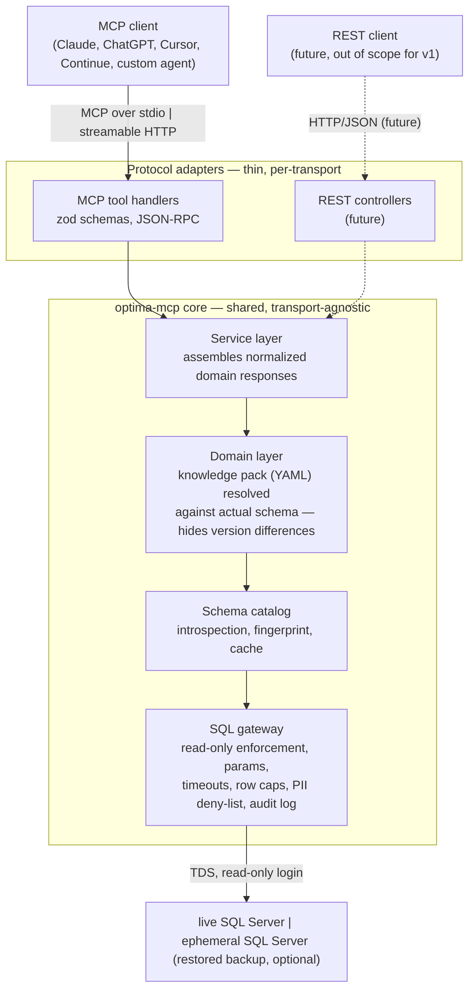

# 03 — Architecture

## 3.1 Layers



Each layer is independently testable. Safety lives in the gateway, version drift in the catalog, Optima knowledge in the domain layer, and the protocol adapters stay thin.

The server is a **DB-access wrapper, not a diagnostic engine**: tools return normalized, domain-level data — the domain layer's job is translating an Optima-version-specific schema into a stable shape, not judging it. Ranking, rule-checking, and interpretation are the calling agent's job.

The **service layer** is the seam for the REST future stated in §3.2/§3.3: it holds the actual tool logic (resolving domain entities via the domain layer, shaping the response) with no MCP types in it. An MCP tool handler and a future REST controller both call the same service functions and only differ in how they parse input and serialize output. Nothing here ships for v1 beyond writing the v1 MCP handlers as thin wrappers over service functions from the start, so there is no rewrite when REST is prioritized.

## 3.2 Deployment: local first

**Decided:** v1 is **local desktop only** — the server runs on the user's machine next to their MCP client (Claude Desktop, Claude Code, Cursor, Continue), speaking stdio.

Consequences, all of them simplifying:

- **The DB credential never leaves the machine.** No TLS termination, no auth layer, no multi-tenancy, no secret storage service.
- **We are not a data processor.** No DPA, no data-residency question, no shared-infrastructure risk on a database full of payroll data ([`01`](01-integration-landscape.md)). This is the single largest reason to start local.
- The SQL Server is reachable directly — either the user's existing Optima instance, or a local one holding a restored backup ([`02`](02-optima-data-model.md) §2.7.1).
- Audit log is a local file, which is what an auditor wants anyway.

Streamable HTTP stays in the design (§3.3) because the SDK gives it for free and the service layer is transport-agnostic, but **hosted deployment is out of scope for v1** and must not drive any v1 decision. Revisit once the tool surface has proven itself.

## 3.3 Vendor neutrality

- Plain MCP, no client-specific extensions. Target spec revision 2025-06-18 minimum; verify the current revision at build time and negotiate down rather than requiring the newest.
- **stdio is the v1 transport.** Streamable HTTP is implemented but unsupported/undocumented until hosted deployment is on the table. Same tool surface either way.
- The MCP tool handlers are a thin protocol adapter over the service layer (§3.1); they hold no business logic. This is what keeps a future REST adapter additive rather than a rewrite.
- **No sampling or elicitation in the core path.** Optional protocol features with uneven client support; a tool that requires them breaks on half the ecosystem. Optional UX only, with a working fallback.
- `readOnlyHint: true`, `openWorldHint: false` on every tool. These are trust hints, not enforcement — enforcement is §3.7 — but they let clients present the server honestly.
- Output is text/Markdown. Attach structured content where supported, but the primary payload must be readable without a schema the model has to be taught.
- Neutral tool descriptions, no vendor names.

## 3.4 Stack — TypeScript / Node

| Concern | Choice | Notes |
|---|---|---|
| Runtime | **Node 24 LTS**, TypeScript, ESM | Node 24 gives stable built-in `node:sqlite` and `node:test`, so we can avoid native deps entirely (see cache row). |
| MCP | **`@modelcontextprotocol/sdk`** | Official TS SDK. Handles both transports, tool annotations, lifecycle. Don't hand-roll the protocol. |
| Tool schemas | **`zod`** | Already an SDK dependency; JSON Schema is generated from it. |
| DB driver | **`mssql`** (node-mssql, Tedious driver) | Pure JS — no ODBC system driver, no native build. Meaningful advantage over the Python path: `npx optima-mcp` works with zero system prerequisites. Supports SQL auth, Entra ID, encryption, pooling, per-request timeouts and cancellation. |
| Decimal handling | **`decimal.js`** + cast in SQL | See §3.5. Non-negotiable. |
| SQL parsing | **`node-sql-parser`** (`transactsql` dialect) | Used to *prove* a statement is read-only rather than regex-guessing. Belt-and-braces: we generate all SQL ourselves from resolved identifiers anyway. |
| Local cache | **`node:sqlite`** (built-in) | Schema catalog, resolved knowledge pack, chart-of-accounts snapshots, keyed by schema fingerprint. `better-sqlite3` is the fallback if we need a Node 22 baseline, at the cost of a native build. |
| Knowledge pack | **`yaml`** | Diffable, reviewable by accounting people who don't write TS. |
| Tests | **`vitest`** + testcontainers-style SQL Server fixture | Fixture DB is how we regression-test knowledge-pack resolution across Optima versions. |
| Build / dist | **`tsup`/esbuild** → single bundled ESM CLI | Install friction kills MCP server adoption. `npx optima-mcp` must just work. Docker image as the second option. |
| Package manager | `pnpm` | |

## 3.5 JS-specific hazard: decimals

JS `Number` is float64. Tedious returns SQL `DECIMAL`/`NUMERIC`/`MONEY` as `Number`, which silently loses exactness. For accounting output that is a correctness bug, not a rounding nit.

Rules:

1. **Aggregate in SQL, not in JS.** `SUM()` server-side; bring across totals, not rows to add up. This is also the right call for context economy (§3.9).
2. **Cast on the way out**: `CAST(SUM(x) AS VARCHAR(40))`, parse into `decimal.js`. Never let a monetary value transit as a JS `Number`.
3. Any arithmetic the service layer does when shaping a response (e.g. summing a returned page) uses `Decimal`, never `number`.
4. Format once, at output, with explicit scale.

Worth a lint rule and a test that fails on any `number`-typed monetary field.

## 3.6 Connection model and startup

Two ways in, both resolved **before** the server starts serving MCP. There is no connect tool and no restore tool — the data source is fixed for the process lifetime.

```
# A. live connection to an existing Optima database
npx optima-mcp --profile biuro-klient-abc

# B. restore a backup once, then serve from it   ([`02`] §2.7)
npx optima-mcp --backup ./CDN_ABC.bac
npx optima-mcp --backup ./CDN_ABC.bac --sql-server "localhost\OPTIMA"

# helpers
npx optima-mcp restore ./CDN_ABC.bac    # prewarm: do the slow restore in a terminal
npx optima-mcp clean                    # drop restored DBs and delete files
```

Profile shape:

```
profile:
  name        "biuro-klient-abc"
  server      host,port | named instance
  auth        SQL login (read-only) | Windows/Kerberos
  company_db  CDN_ABC
  config_db   CDN_KNF_Konfiguracja      (optional)
  encrypt     true (default; trustServerCertificate opt-in for on-prem)
```

Profiles are configured out of band — env vars or a local config file — and referenced by name. **Connection strings never enter the model context.** Tools take `profile="biuro-klient-abc"`, never a host and password. The model can't leak a credential it never sees.

**Startup failures are loud and terminal.** Unreachable server, wrong collation, over-privileged login, backup that won't restore, engine too old for the backup — all fail at launch with a specific message on stderr, not as a tool error three turns into a conversation.

## 3.7 Read-only enforcement

Five layers, none trusted alone:

1. **DB permissions.** The only actually sufficient control: a login with `db_datareader` plus `DENY SELECT` on personal-data tables, nothing else. Ship the exact `CREATE LOGIN`/`CREATE USER`/`GRANT` script; warn loudly when connected as anything more privileged.
2. **Connection level.** `ApplicationIntent=ReadOnly` where a readable secondary exists; snapshot isolation or explicit `WITH (NOLOCK)` so we never block a live system. Blocking a month-end close is the fastest route to being uninstalled.
3. **Statement gate.** Parse with `node-sql-parser`; reject unless a single `SELECT`/CTE. No DML, DDL, `EXEC`, `sp_executesql`, multi-statement batches, or `INTO`.
4. **Resource limits.** Per-query timeout, row cap, result-size cap, concurrency limit. An LLM will eventually ask for `SELECT * FROM CDN.Dekrety`; decline gracefully and suggest an aggregate.
5. **Audit log.** Every statement, with profile, timestamp, row count, duration, written locally. Customers will be asked by their auditor what this thing did to the books.

Plus a **PII deny-list** from Comarch's personal-data inventory, applied at the gateway. Denied by default; explicit per-profile opt-in, results pass through redaction.

## 3.8 Output contract

Every tool returns normalized domain data, not a raw table dump and not a diagnosis:

```
DATA        the requested domain entities (accounts, balances, journal
            lines, ...), same shape regardless of Optima version
META        which DB/profile/period, row count, truncation info
CAVEATS     unresolved schema concepts, assumptions made while normalizing
```

The server does not rank, interpret, or recommend — that's the calling agent's job on top of normalized data. Verification and drill-down beyond a tool's own parameters is a read-only SQL snippet the user can paste into Optima's SQL console or SSMS; the server never emits `UPDATE`/`INSERT`/`DELETE` (§3.7).

**Language:** field values use Polish domain terms (plan kont, obroty, salda, zestawienie, gałąź, bufor) regardless of conversation language — those are the words on the screen the user is looking at. Surrounding prose follows the user's language.

## 3.9 Context economy

A real chart of accounts runs to thousands of accounts; `CDN.Dekrety` to millions of rows.

- **The model sees normalized domain data, not raw Optima tables.** Aggregation happens in SQL/TS, deterministically; the LLM doesn't do arithmetic over 5,000 rows.
- **Progressive disclosure.** Summary → drill-down → detail, each taking an explicit narrowing argument.
- **Hard caps with honest truncation.** Never silently drop rows. "Showing 20 of 347 rows; narrow with `account_prefix=`."
- **Cache by fingerprint** so a multi-tool conversation doesn't re-introspect per call.
- **MCP resources** for reference material (resolved schema map, knowledge pack, account-type conventions) so clients pull on demand instead of us pushing into every result.
