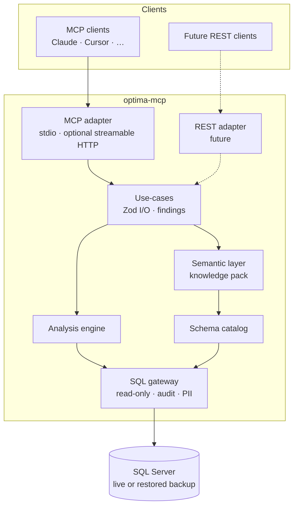
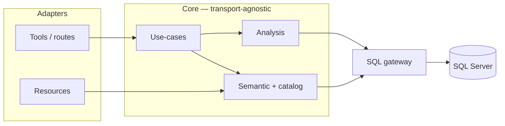
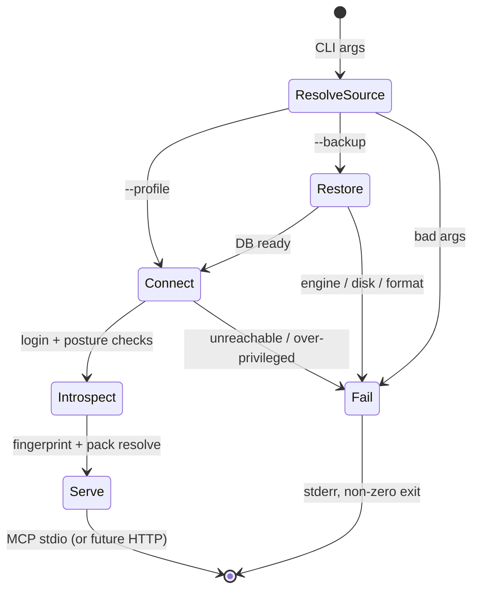

# 03 — Architecture

Domain logic is transport-agnostic. MCP is the v1 surface; a REST API must be addable later without reshaping the core.

## 3.1 Non-functional requirements

| NFR | Constraint |
|---|---|
| **Local-first (v1)** | Desktop process next to the MCP client (stdio). Credentials never leave the machine; we are not a data processor for payroll-heavy DBs ([`01`](01-integration-landscape.md)). |
| **Read-only by design** | DB permissions + statement gate + PII deny-list. No mutations from the server. |
| **Correct money** | No float64 for amounts. Aggregate in SQL; arithmetic via `decimal.js`. |
| **Install friction** | `npx optima-mcp` with zero system prerequisites (pure JS driver, bundled ESM). |
| **Vendor-neutral MCP** | Plain MCP (spec ≥ 2025-06-18). No client-specific extensions; no sampling/elicitation on the core path. |
| **Context economy** | Findings, not table dumps. Progressive disclosure; hard caps with honest truncation. |
| **Simplicity** | Thin adapters; one responsibility per layer; fail loud at startup, not mid-conversation. |
| **Extensibility — REST** | Same use-cases and Zod schemas must mount behind HTTP (e.g. Hono/Fastify) without duplicating domain code. MCP and REST are adapters over one core. |

Hosted / streamable-HTTP deployment is out of scope for v1 and must not drive v1 decisions. Revisit once the tool surface is proven.

## 3.2 Overview



Safety lives in the gateway, version drift in the catalog, Optima knowledge in the semantic layer, analysis in the engine. Adapters stay thin.

## 3.3 Layers

| Layer | Role |
|---|---|
| **Adapters** | MCP tools/resources (and later REST routes). Map protocol ↔ use-case; no SQL, no accounting rules. |
| **Use-cases** | One function per capability. Zod in / findings out. Shared by every transport. |
| **Analysis engine** | Mask expansion, coverage matrix, rule checks, materiality ranking. Deterministic; uses `Decimal`. |
| **Semantic layer** | Knowledge pack (YAML) resolved against the live schema. |
| **Schema catalog** | Introspection, fingerprint, local SQLite cache. |
| **SQL gateway** | Param queries, read-only proof, timeouts, row caps, PII deny-list, audit log. |



Each layer is independently testable. Adding a REST route is: bind HTTP ↔ existing use-case; do not fork analysis or SQL.

## 3.4 Transports

### MCP (v1)

- Official `@modelcontextprotocol/sdk` — do not hand-roll the protocol.
- **stdio** is the supported transport. Streamable HTTP may ship unimplemented/undocumented until hosted is in scope; same tool surface either way.
- Tool annotations: `readOnlyHint: true`, `openWorldHint: false` (hints only — enforcement is §3.8).
- Primary payload: text/Markdown findings. Attach structured content where the client supports it; never require the model to learn a private schema.
- Neutral descriptions; no vendor names in tool copy.
- Prefer MCP **resources** for reference material (resolved schema map, knowledge pack) so clients pull on demand.

### REST (extension path)

Not built in v1. Architecture requirement only:

- Mount the same use-cases under `/v1/...` (JSON body = Zod schema already used by MCP tools).
- Reuse gateway, audit log, and findings shape; map findings → JSON (and optionally keep a `text/markdown` representation).
- Auth, TLS, and multi-tenancy appear only with a network listener — they must not leak into the core or into stdio v1.

## 3.5 Stack

| Concern | Choice | Why |
|---|---|---|
| Runtime | Node 24 LTS, TS, ESM | Built-in `node:sqlite` / `node:test`; avoid native deps |
| MCP | `@modelcontextprotocol/sdk` | Official; both transports, annotations, lifecycle |
| Schemas | `zod` | Shared by MCP tools and future REST; JSON Schema from Zod |
| DB | `mssql` (Tedious) | Pure JS — `npx` works with no ODBC/system driver |
| Money | `decimal.js` + SQL `CAST(… AS VARCHAR)` | See §3.6 |
| SQL proof | `node-sql-parser` (`transactsql`) | Prove read-only; we still generate SQL from resolved IDs |
| Cache | `node:sqlite` | Catalog + pack cache keyed by schema fingerprint |
| Knowledge pack | `yaml` | Diffable; reviewable by accountants |
| Tests | `vitest` + SQL Server fixture | Pack resolution across Optima versions |
| Dist | `tsup`/esbuild → one ESM CLI | Install friction kills MCP adoption |
| Package manager | `pnpm` | |

Optional later: thin HTTP framework (Hono/Fastify) beside the MCP entrypoint — same process or a second binary sharing `src/core`.

## 3.6 Decimals

JS `Number` is float64; Tedious returns `DECIMAL`/`MONEY` as `Number`. For accounting that is a correctness bug.

1. Aggregate in SQL (`SUM`), not in JS.
2. Cast out: `CAST(SUM(x) AS VARCHAR(40))` → `decimal.js`. Never transit money as `number`.
3. Analysis arithmetic uses `Decimal` only.
4. Format once at output, with explicit scale.

Lint + a test that fails on any `number`-typed monetary field.

## 3.7 Connection and startup

Data source is fixed for the process lifetime — no connect/restore tools.

```
npx optima-mcp --profile biuro-klient-abc
npx optima-mcp --backup ./CDN_ABC.bac
npx optima-mcp --backup ./CDN_ABC.bac --sql-server "localhost\OPTIMA"
npx optima-mcp restore ./CDN_ABC.bac   # prewarm
npx optima-mcp clean
```



Profiles (env or local config) are referenced by name. **Connection strings never enter model context.** Tools take `profile="…"`, never host/password.

Startup failures are terminal on stderr: unreachable server, wrong collation, over-privileged login, restore failure, engine too old.

Profile fields: `name`, `server`, `auth` (SQL read-only | Windows/Kerberos), `company_db`, optional `config_db`, `encrypt` (default true; `trustServerCertificate` opt-in).

## 3.8 Read-only enforcement

None of these alone is enough:

1. **DB permissions** — `db_datareader` + `DENY SELECT` on personal-data tables. Ship the exact grant script; warn if more privileged.
2. **Connection** — `ApplicationIntent=ReadOnly` when available; snapshot / `NOLOCK` so we never block month-end.
3. **Statement gate** — parse with `node-sql-parser`; single `SELECT`/CTE only. No DML/DDL/`EXEC`/batches/`INTO`.
4. **Resource limits** — timeout, row cap, result-size cap, concurrency.
5. **Audit log** — every statement locally (profile, time, rows, duration).

Plus a **PII deny-list** from Comarch’s inventory at the gateway: deny by default; per-profile opt-in with redaction.

## 3.9 Output and context

Every use-case returns a findings document:

```
SUMMARY     what was checked, DB/period, verdict
FINDINGS    ranked by PLN materiality; evidence; remediation
NEXT STEPS  next tool / drill-down
CAVEATS     unresolved concepts, buffer in/out, assumptions
```

Remediation:

- **UI steps** (default for changes) — keep the user in supported Optima behaviour ([`01`](01-integration-landscape.md)).
- **`SELECT`-only SQL** — verification/drill-down for Optima SQL console or SSMS.

> **Decision needed.** Brief said “SQL snippet user will execute” (could mean mutations). Narrowed to read-only SQL + UI steps for writes: emitting `UPDATE` bypasses validation and risks support void. Write-SQL, if wanted, must be separately gated and off by default.

**Language:** Polish domain terms (plan kont, obroty, salda, …) in findings; surrounding prose follows the user.

Context rules:

- Model sees findings, not raw tables — evaluation is deterministic in TS.
- Progressive disclosure (summary → drill-down → detail).
- Hard caps; never silent truncation.
- Cache by schema fingerprint across a session.
- MCP resources for reference material (and the same payloads for REST `GET` later).
